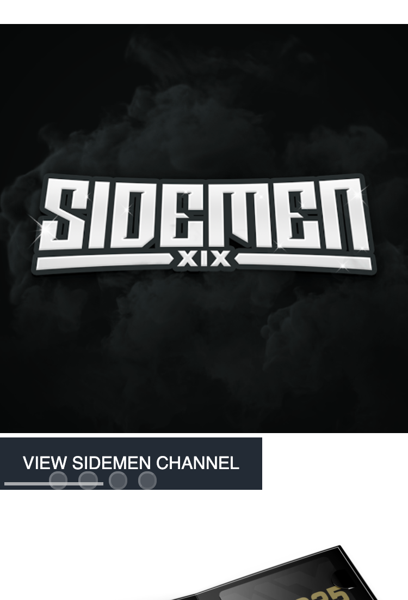

# Procesverslag
Markdown is een simpele manier om HTML te schrijven.  
Markdown cheat cheet: [Hulp bij het schrijven van Markdown](https://github.com/adam-p/markdown-here/wiki/Markdown-Cheatsheet).

Nb. De standaardstructuur en de spartaanse opmaak van de README.md zijn helemaal prima. Het gaat om de inhoud van je procesverslag. Besteedt de tijd voor pracht en praal aan je website.

Nb. Door *open* toe te voegen aan een *details* element kun je deze standaard open zetten. Fijn om dat steeds voor de relevante stuk(ken) te doen.

## Jij

uitwerken voor kick-off werkgroep

### Auteur:
Yeliz Erbas :)

#### Je startniveau:
Blauw

#### Je focus:
Surface plane
 

## Je website

uitwerken voor kick-off werkgroep

### Je opdracht:
https://www.sidemenclothing.com

#### Screenshot(s) van de eerste pagina (small screen): 
Home Pagina  

#### Screenshot(s) van de tweede pagina (small screen):
Merch Shop 

 

## Breakdownschets (week 1)

uitwerken na afloop 2e werkgroep

### de hele pagina: 

### dynamisch deel (bijv menu): 

## Voortgang 1 (week 2)

uitwerken voor 1e voortgang

### Stand van zaken
Tot nu toe gaat het best prima. Ik heb wel het gevoel dat ik al wat verder hoor te zijn.
Ik loop een beetje vast met mijn carousellen en knopjes, maar het zal allemaal vast wel goed komen.

### Agenda voor meeting
samen met je groepje opstellen

| Yeliz          | Larissa         | Laurens      | Lindsey     |
| ---            | ---             | ---          | ---         |
| Geen vraag     | Knop centreren  | Animatie     | Footer      |
|                |                 |              |             |
|                |                 |              |             |

### Verslag van meeting
hier na afloop snel de uitkomsten van de meeting vastleggen

- Zo min mogelijk divs
- Button veranderen naar a
- Dubbele dingen weghalen zoals li p /p /li>
- Voor de rest ben ik goed op gang volgens de student assistenten

## Voortgang 2 (week 3)

uitwerken voor 2e voortgang

### Stand van zaken
Op dit moment gaat het erg goed. Mijn eerste pagina is zo goed als af. 
Inclusief het hamburger menu. Het enige wat ik nog wil doen is de "carousel" 
in het midden krijgen. Ik ben dus best goed op gang. Als mijn tweede pagina af is 
moet ik nog de surface plane dingen toevoegen en al mijn code netjes en overzichtelijk maken met comments.

### Agenda voor meeting
samen met je groepje opstellen

| Yeliz          | Larissa         | Anneke        | Lindsey     |
| ---            | ---             | ---           | ---         |
| Tweede Pagina  | Dark mode       | Geen vraag    | Geen vraag  |
|                |                 |               |             |
|                |                 |               |             |

### Verslag van meeting
hier na afloop snel de uitkomsten van de meeting vastleggen

- Kiezen welke pagina ik wil, een pagina is niet perse beter dan de ander
- Png op hidden zetten voor darkmode

## Toegankelijkheidstest (week 4)

uitwerken na test in 8e voortgang

### Bevindingen
Lijst met je bevindingen die in de test naar voren kwamen:

#### Parkinson apparaat
Ik heb de parkinson apparaat geprobeerd, en tot mijn vernazing ging het erg makkelijk.
Ik had niet echt moeite met scrollen op de touchpad en ik kon de knoppen heel makkelijk aanklikken.
Ook heeft Laurens mijn website getest. Hij kon het ook zonder enige problemen gebruiken.

#### Ballon 
Het hooghouden van een ballon en een website goed gebruiken is wat lastiger. Het is heel irritant om
de heletijd ergens anders mee bezig te zijn terwijl je een website wilt gebruiken. Ik vond wel dat 
mijn webiste hele duidelijke stukken heeft dus je weet wel waar je bent. 

#### Kleuren bril 
Met de gele kleuren bril hoor je denk ik "kleurenblind" te moeten zien. Al hoewel er heel veel verschillende
soorten van kleurenblindheid is, merkte ik er bijna niks van op mijn website. Je kon alles goed van elkaar
scheiden.

Als ik het toegangelijk zou willen maken voor kleurenblinden zou ik een functie kunnen toevoegen waarbij kleuren
worden aangepast naar een bepaalde soort kleurenblindheid. Er zijn er natuurlijk te veel, maar als je er een paar
uitkiest die het meest voorkomend (bij. rood en groen kleurenblindheid) zijn hel je gelijk een hele grote groep.

#### States 
Bij deze test had ik helaas nog niet de tijd om de states van de knoppen uit te werken. Dus al die states moeten
nog uitgewerkt worden. Daarom kon je ook mijn webiste nier besturen met 'tab', wat wel erg belangrijk is.

#### Screenreader 
De screenreader vond ik zelf erg lastig om te begrijpen en besturen, maar als je het gewend bent gaat het 
waarschijnlijk een stuk makkelijker. Ik had nog bijna geen alt teksten geplaatst. De teksten die ik wel had 
geplaatst maakten het wel erg duidelijk voor de gebruiker wat er op een foto staat of wat je met het kruisje 
knopje kan van de navigatie. Dus dat vind ik wel erg mooi om te zien.

#### Blurred vision 
Deze wes erg vervelend. Ik heb zelf lenzen, maar dat ik omdat ik in de verte niet kan zien. Van 
dicht bij niet zien is toch wat anders. De kleinere stukken tekst waren lastig op te lezen, 
maar de grote headers niet.

Hoe ik dit het beste kan oplossen is om een functie toe te voegen waarbij je zelf de lettergrootte kan 
instellen. Zo kunnen mensen die blurred zien de tekst toch wel lezen, en hoeven ze niet heel dicht op hun
scherm te zitten.

#### Perifial fieldloss 
Bij deze bril kon je alleen een heel klein beetje in het midden zien. Het is natuurlijk erg vervelen dat je
maar zo een kleine oppvervlakte kunt zien, maar weer tot mijn verbazing kon je mijn webiste erg goed zien. 
Ik weet zelf niet waardoor dit komt. 

## Voortgang 3 (week 4)

uitwerken voor 3e voortgang

### Stand van zaken
Tot nu toe gaat het goed. Ik moet nog wel alle alt teksten en states van de buttons doen. Ook moet ik de animaties en darkmode nog doen. Mijn doel voor nu is om eerst mijn tweede pagina af te maken.

### Agenda voor meeting
samen met je groepje opstellen

| Yeliz          | Larissa         | Anneke        | Lindsey     |
| ---            | ---             | ---           | ---         |
| Nav dom-       | Footer          | Css opschonen | Geen vraag  |
| manipulatie    |                 |               |             |
|                |                 |               |             |

### Verslag van meeting
hier na afloop snel de uitkomsten van de meeting vastleggen

- Je moet zelf je css opschonen
- Weinig vragen, iedereen is goed op weg

## Eindgesprek (week 5)

uitwerken voor eindgesprek

### Stand van zaken
Ik vond dit vak heel leuk om te volgen. Alleen jammer dat het zo kort is. Ik had namelijk veel meer willen toevoegen aan mijn site, maar daar had ik helaas de tijd niet voor. Wel heb ik in de korte 4 weken tijd veel geleerd. Het leukste wat ik heb geleerd is denk ik toch wel dark mode. Ik ben zelf erg fan van light mode, maar ik vind het toch heel vet dat ik dat nu kan maken. Er zijn niet perse dingen die ik lastig vind, behalve het maken van een goede carousel. Dat wil ik nog wel graag leren.

### Screenshot(s)

## Bronnenlijst

continu bijhouden terwijl je werkt

Nb. Wees specifiek ('css-tricks' als bron is bijv. niet specifiek genoeg).

1. https://codepen.io/yelizerbas/pen/QWqwbmQ Animaties opdracht
2. https://codepen.io/shooft/pen/dyRVVRr?editors=1010 Hamburger menu
3. https://stackoverflow.com/questions/44278584/css-drop-shadow-body box-shadow op body

